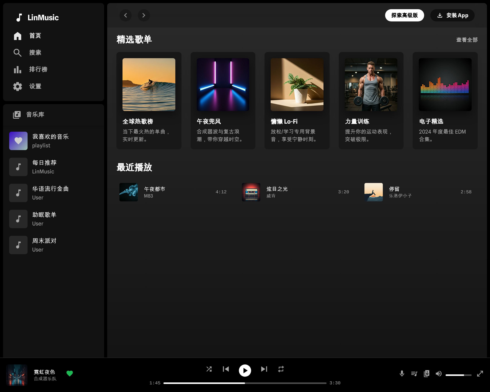
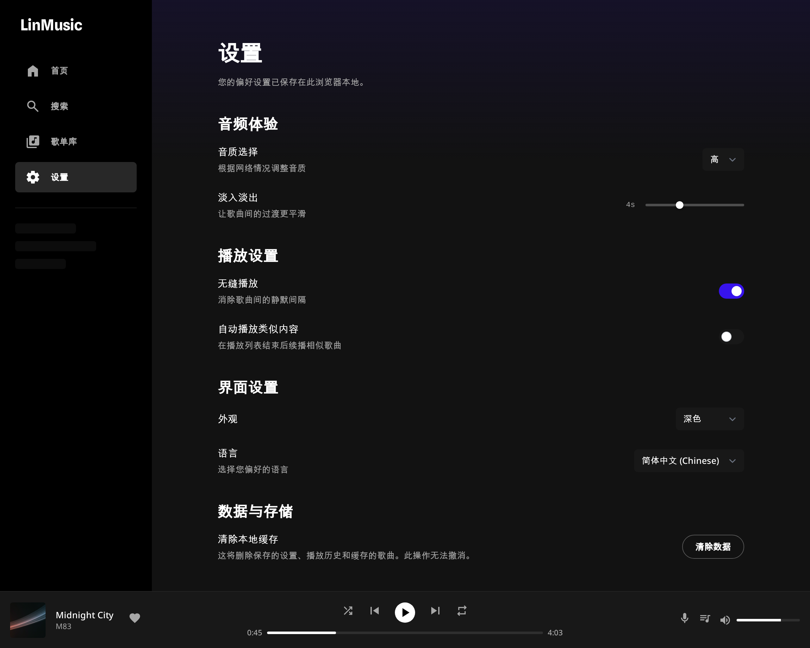
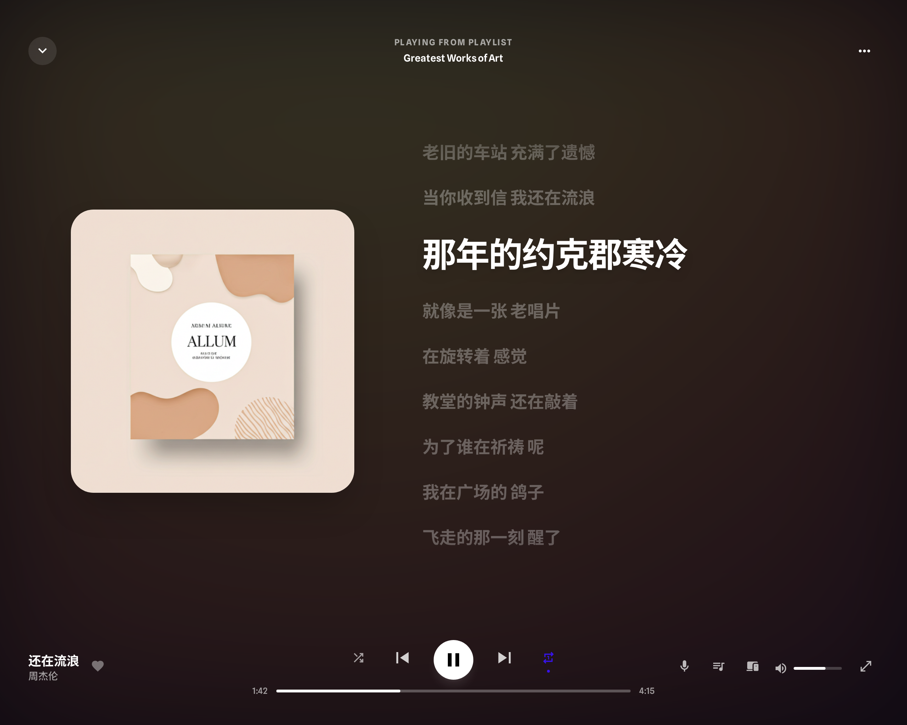
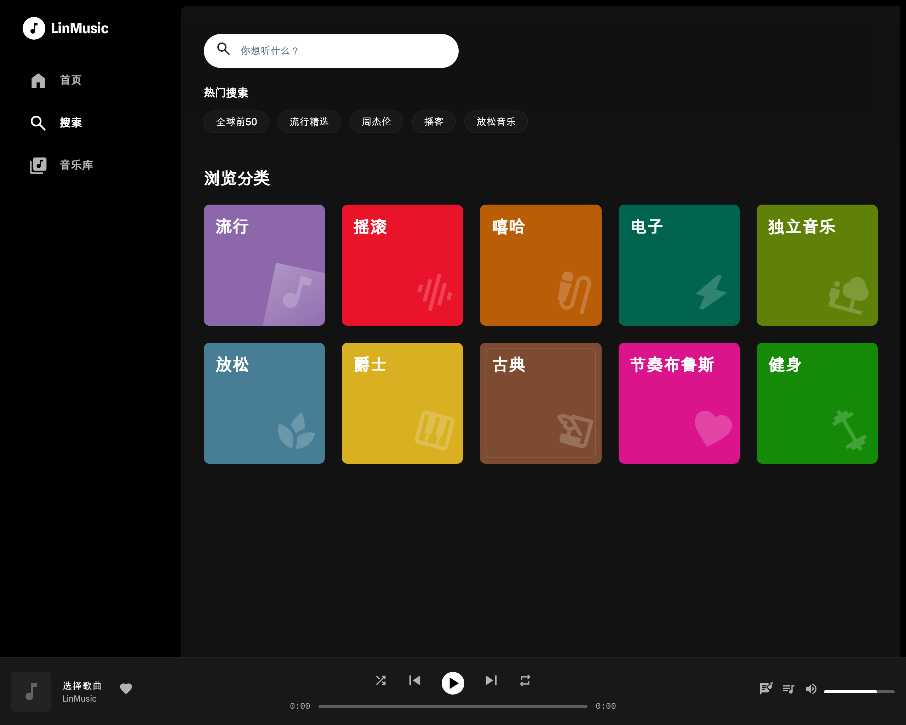
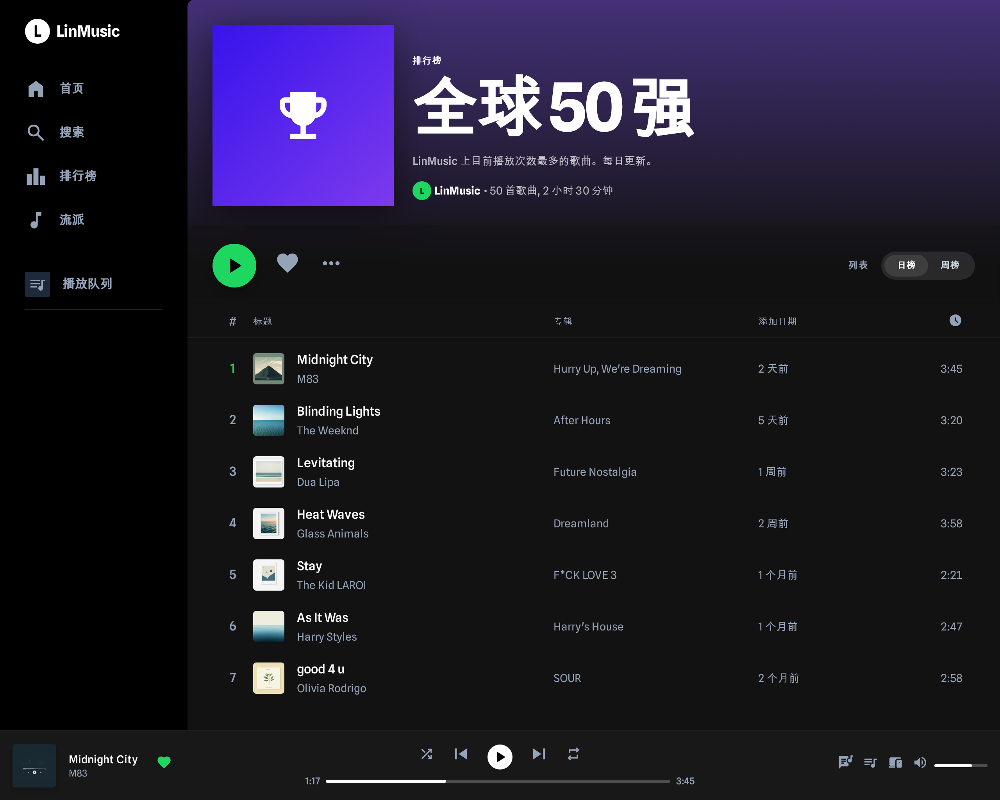

# LinMusic

## 简介

LinMusic 是一个基于 Vue 3 构建的现代化 Web 音乐播放器，支持多平台音乐搜索和播放。项目采用 PWA 技术，可添加到主屏幕作为独立应用使用，支持后台播放和锁屏控制。


| 首页 | 设置页 | 歌词预览页 |
|------|--------|-----------|
|  |  |  |

| 搜索页 | 排行页 | 我喜欢的音乐 |
|------|--------|-----------|
|  |  |  |


#阿里云ESA Pages #阿里云云工开物

本项目是**阿里云 ESA (Edge Security Acceleration) 边缘计算创新大赛**的创意参赛作品。
借助 **阿里云 ESA** 强大的边缘计算能力，我们将这个富交互的静态网站分发到全球节点，确保用户在世界任何角落都能体验到闪电般的加载速度。


## 功能特性

### 核心功能
- **多平台搜索** - 聚合网易云音乐、酷我音乐、QQ音乐
- **在线播放** - 支持多种音质选择 (128k/320k/FLAC)
- **歌词同步** - 实时歌词显示，支持滚动跟随
- **播放列表** - 自定义歌单管理，支持导入外部歌单

### 播放控制
- **播放模式** - 顺序播放、单曲循环、随机播放、列表循环
- **进度控制** - 拖动进度条，快进快退
- **音量调节** - 音量滑块控制

### PWA 特性
- **离线支持** - 添加到主屏幕后可离线访问
- **后台播放** - 支持 iOS/Android 后台播放
- **锁屏控制** - 锁屏界面显示封面、歌曲信息和播放控制
- **媒体控制** - 支持系统媒体控制中心

### 其他功能
- **排行榜** - 各平台热门排行榜
- **收藏夹** - 喜欢的歌曲收藏
- **歌曲下载** - 支持歌曲下载到本地
- **深色模式** - 默认深色主题，护眼舒适


## 快速开始

### 环境要求

- Node.js >= 18.0.0
- npm >= 9.0.0

### 安装

```bash
# 克隆项目
git clone https://github.com/YforC/LinMusic.git
cd LinMusic

# 安装依赖
npm install
```

### 本地开发

```bash
# 启动开发服务器
npm run dev
```

访问 http://localhost:3000 查看应用。

### 构建

```bash
# 构建生产版本
npm run build

# 预览构建结果
npm run preview
```


## 技术栈

### 前端
| 技术 | 说明 |
|------|------|
| Vue 3 | 渐进式 JavaScript 框架 |
| TypeScript | 类型安全的 JavaScript 超集 |
| Vite | 下一代前端构建工具 |
| Tailwind CSS | 原子化 CSS 框架 |
| Pinia | Vue 状态管理库 |
| Vue Router | Vue 官方路由 |

### 后端
| 技术 | 说明 |
|------|------|
| Cloudflare Pages | 边缘部署平台 |
| Cloudflare D1 | 边缘 SQLite 数据库 |
| Pages Functions | Serverless 函数 |

### 音乐 API
| 平台 | 支持功能 |
|------|----------|
| 网易云音乐 | 搜索、播放、歌词、排行榜 |
| 酷我音乐 | 搜索、播放、歌词、排行榜 |
| QQ音乐 | 搜索、播放、歌词、排行榜 |

## 项目结构

```
LinMusic/
├── public/                 # 静态资源
│   ├── favicon.svg        # 网站图标
│   └── manifest.webmanifest # PWA 配置
├── src/
│   ├── api/               # API 接口封装
│   │   ├── music.ts       # 音乐 API
│   │   └── types.ts       # 类型定义
│   ├── components/        # Vue 组件
│   │   ├── layout/        # 布局组件
│   │   ├── player/        # 播放器组件
│   │   └── common/        # 通用组件
│   ├── stores/            # Pinia 状态管理
│   │   └── player.ts      # 播放器状态
│   ├── views/             # 页面视图
│   ├── router/            # 路由配置
│   ├── utils/             # 工具函数
│   ├── App.vue            # 根组件
│   └── main.ts            # 入口文件
├── functions/             # Cloudflare Functions
│   └── api/               # API 路由
├── migrations/            # 数据库迁移
├── index.html             # HTML 入口
├── vite.config.ts         # Vite 配置
├── tailwind.config.js     # Tailwind 配置
├── tsconfig.json          # TypeScript 配置

```

## 开发指南

### 代码规范

- 使用 TypeScript 进行类型检查
- 遵循 Vue 3 Composition API 风格
- 组件命名采用 PascalCase
- 文件命名采用 kebab-case

### 提交规范

```
feat: 新功能
fix: 修复 bug
docs: 文档更新
style: 代码格式调整
refactor: 代码重构
perf: 性能优化
test: 测试相关
chore: 构建/工具相关
```

## 常见问题

### iOS PWA 后台播放

iOS PWA 对后台播放有限制，需要：
1. 将网站添加到主屏幕
2. 从主屏幕图标启动应用
3. 播放音乐后可锁屏继续播放

### 音乐无法播放

1. 检查网络连接
2. 尝试切换音乐平台
3. 尝试降低音质设置

## 声明
“本项目由阿里云ESA提供加速、计算和保护”


